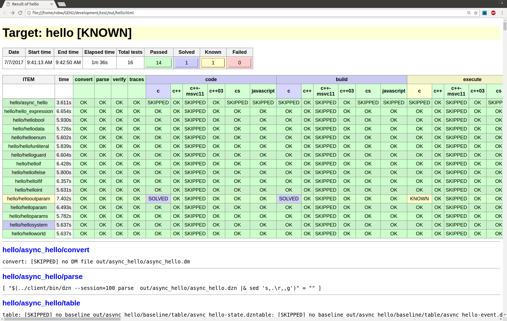
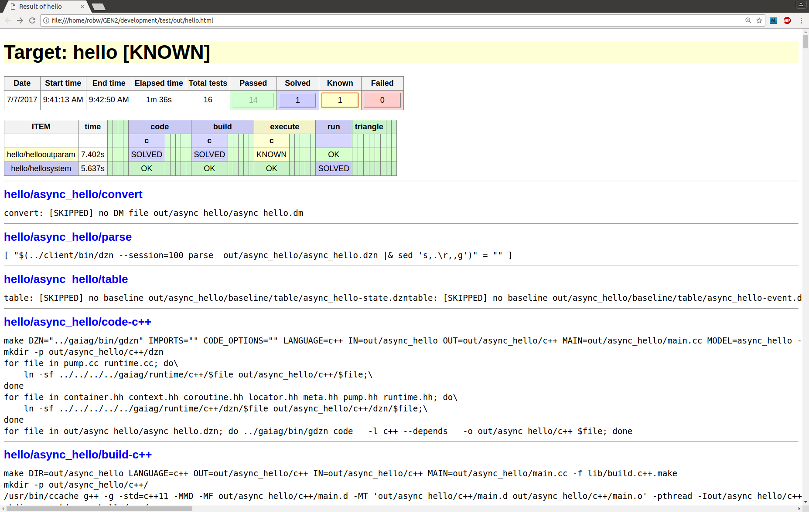

DZN TEST FRAMEWORK
==================

The Dezyne test framework supports continuous integration in the 
Dezyne tool set development. It is easy to add tests, and to switch on and off
the testing of the various Dezyne language aspects.

The test framework is written in javascript, and in its current implementation 
highly depends on the nodejs _Q_ module, which implements promises 
(see https://github.com/kriskowal/q for more info).

Test set
--------

Each test _foo_ is available in the _test/all/foo_ directory, 
with the following restrictions:
the model under test (interface or component) must be named _foo_.
the dezyne file containing the model must be named _foo.dzn_;
Note that there may be more than one dzn file, and more than one model 
involved in the test.

Groups of test can be identified by collecting them (as symbolic links) in a 
dedicated directory. An example is _test/hello_ which currently contains
the follwing tests:

      async_hello -> ../async/async_hello/
      hellobool -> ../all/hellobool/
      hellodata -> ../all/hellodata/
      helloenum -> ../all/helloenum/
      hello_expression -> ../all/hello_expression/
      hellofunliteral -> ../all/hellofunliteral/
      helloguard -> ../all/helloguard/
      helloif -> ../all/helloif/
      helloifelse -> ../all/helloifelse/
      helloifif -> ../all/helloifif/
      helloint -> ../all/helloint/
      hellooutparam -> ../all/hellooutparam/
      helloparam -> ../all/helloparam/
      helloparams -> ../all/helloparams/
      hellosystem -> ../all/hellosystem/
      helloworld -> ../all/helloworld/

Aspect testing
--------------

The Dezyne features (or __aspects__, as they are called here) are tested independently. 
Most aspects depend on other ones, and testing of such an aspect is suppressed when 
there is a failure in its dependent ones.

The following dezyne aspects are tested

* __convert__	: conversion from ASD to dezyne; this test succeeds if there is no ASD model
* __parse__	: file syntax and well-formedness 
* __verify__ : model verification 
* __traces__ : generate all possible traces through model
* _language_:__code__ : generate code for language
* _language_:__build__ : compile generated code (depends on _code_)
* _language_:__execute__ : execute generated code on all generated traces (depends on _execute_ and _traces_)
* __run__ : simulate model for all generated traces (depends on _traces_)
* _language_:__triangle__ : compare results of execute and run for each trace (depends on _execute_ and _run_)
* __table__ : generate tables for model
* __view__ : generate views for model

Where language is one of the following:

* _c++_, _c++03_, _c++-msvc11_, _c_, _cs_, _javascript_	

Each test can specify which aspects are to be skipped because of irrelevance, 
and which aspects are expected to fail because of known bugs. 
This is done in a __META__ file. An example is file _test/all/async\_context2/META_:

    {"known":["c:build","cs:build"],"skip":["execute","verify","run"],"comment":"livelock model"}

which specifies that _build_ is expected to fail for languages _c_ and _cs_, 
and that _execute_, _verify_, and _run_ are to be skipped.

Baselines
---------

A baseline folder is needed for those test that are expected to fail for some of their aspects. 
No baseline is needed for tests that succeed in all aspects.
For failing tests, results will be compared to the baseline:

* _parse_: a file containing all expected parsing errors messages
* _verify_: files containing all expected verification error messages.

Additionally a number of traces can be specified for a test.
The _traces_ aspect will use these traces, in stead of generating 
all possible traces through the model.

Invocation and Reporting
------------------------

Testing is started from within the _test_ directory. 
Calling __bin/test --help__ shows the following information:

      Usage: bin/test [OPTION]... TARGET (ASPECT | LANGUAGE)*
      Options:
        -h, --help           display this help and exit
        -j, --jobs=JOBS      run a maximum of JOBS in parallel, default is 1
        -o, --output=OUTPUT  write output to OUTPUT [out/TARGET.html]
        -q, --quiet          suppress test summary lines on stdout
        -s, --summary        show only summary lines on stdout
      
      Target: a test directory such as all, check, regression-test
      
      Aspects: build,code,convert,execute,parse,run,table,traces,triangle,verify,view
      Languages: c,c++,c++-msvc11,c++03,cs,javascript
      
      Examples:
        bin/test check
        bin/test all/helloworld code c++
        bin/test check/trip parse

All test results are collected in the _test/out_ directory, 
and upon completion gathered in an html page.
Each aspect test results in one of five states:

* __FAILED__: the test did not succeed
* __KNOWN__: the test failed as expected (specified in the META file)
* __SOLVED__: the test succeeded, but was masked as known in META.
* __SKIPPED__: the test was skipped 
  (either because that was specified in META, or because one of its dependencies 
  did not succeed)
* __OK__: the test succeeded.

A _grand total_ is computed for the test: 

* If one of the tests returns _FAILED_, the total result is __Failed__, depicted in _red_
* else, if one of the tests returns _KNOWN_, the total result is __Known__, depicted in _yellow_
* else, if one of the tests returns _SOLVED_, the total result is __Solved__, depicted in _blue_
* else, the total result is __Passed__, depicted in _green_

The test results are presented in a summary table and in detail, 
as depicted in the screen shot below

The summary can be filtered on each of the four overall statuses by pressing the 
corresponding colored toggle button in the grand total table.
In the screen shot below _Passed_ has been filtered out.

By default only _Failed_ results are visible in the table.

